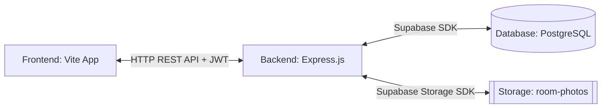
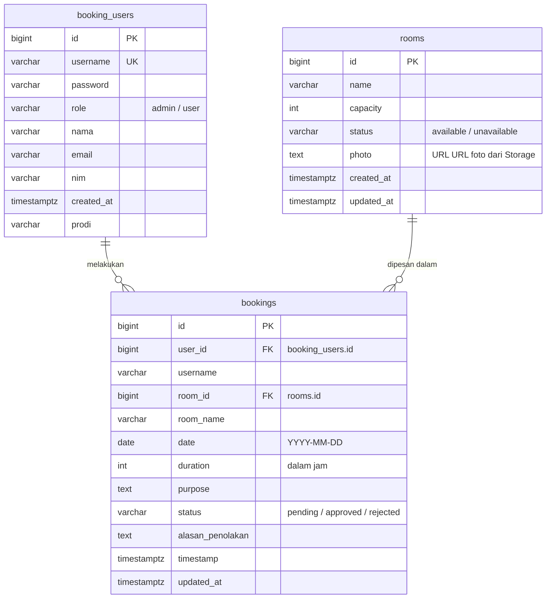
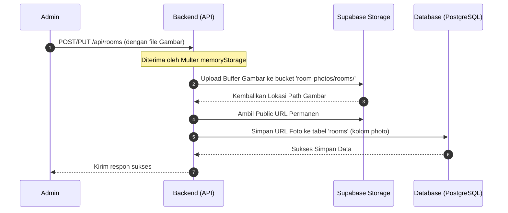

# DOKUMENTASI BACKEND (PRESENTASI LENGKAP)
## 🏢 Sistem Informasi Peminjaman Ruangan (Booking Room)

Dokumentasi ini dirancang dalam format slide presentasi (menggunakan pemisah `---` untuk kompatibilitas dengan viewer presentasi markdown seperti Marp) untuk menjelaskan arsitektur backend, skema database, sistem keamanan, serta API endpoints dari aplikasi Peminjaman Ruangan.

---

# 📑 DAFTAR ISI

1. **Arsitektur & Tech Stack**
2. **Skema Database & ERD**
3. **Sistem Keamanan & Proteksi**
4. **Alur Manajemen File (Storage)**
5. **Daftar API Endpoints**
6. **Skrip Pemeliharaan (Maintenance)**
7. **Langkah Inisialisasi & Konfigurasi**
8. **Panduan Deployment ke Render**

---

# 1. ARSITEKTUR & TECH STACK

Aplikasi ini menggunakan arsitektur **Decoupled (Decoupled Architecture)** di mana Frontend (Vite) berkomunikasi dengan Backend secara asinkronus melalui REST API.



### Komponen Utama Backend:
*   **Express.js**: Framework server minimalis untuk routing dan middleware.
*   **Supabase Client**: Interaksi dengan PostgreSQL dan Media Storage menggunakan Service Role Key (Admin).
*   **JWT (JSON Web Tokens)**: Untuk otentikasi stateless dan otorisasi berbasis peran (Admin/User).
*   **Multer (Memory Storage)**: Untuk menangani penunggahan gambar secara efisien langsung ke buffer memori sebelum dikirim ke Supabase Storage.

---

# 2. SKEMA DATABASE & ERD

Sistem database menggunakan PostgreSQL yang dikelola di cloud **Supabase**. Terdiri dari 3 tabel utama: `booking_users`, `rooms`, dan `bookings`.



---

# DETIL STRUKTUR TABEL (DATABASE SCHEMA)

### 1. Tabel `booking_users` (Peminjam & Admin)
Menyimpan informasi kredensial dan data diri pengguna aplikasi.
*   `id`: Bigint, Generated as Identity, Primary Key.
*   `username`: Varchar(100), Unique, Not Null (untuk login).
*   `password`: Varchar(255), Not Null (hashed menggunakan bcrypt).
*   `role`: Varchar(50), Default 'user' (nilai: `admin` atau `user`).
*   `nama`: Varchar(255), Not Null (Nama Lengkap).
*   `email`: Varchar(255), Not Null (Format divalidasi regex).
*   `nim`: Varchar(50), Not Null (NIM Mahasiswa atau NIP Dosen).
*   `prodi`: Varchar(100), Default 'Teknik Informatika' (Program Studi).
*   `created_at`: Timestamptz, Default `now()`.

---

### 2. Tabel `rooms` (Daftar Ruangan)
Menyimpan data fisik ruangan yang dapat dipinjam.
*   `id`: Bigint, Generated as Identity, Primary Key.
*   `name`: Varchar(255), Not Null (Nama Ruangan).
*   `capacity`: Int, Not Null (Kapasitas Maksimal Orang).
*   `status`: Varchar(50), Default 'available' (status: `available` atau `unavailable`).
*   `photo`: Text, Nullable (URL Publik Gambar Ruangan yang disimpan di bucket Supabase).
*   `created_at`: Timestamptz, Default `now()`.
*   `updated_at`: Timestamptz, Nullable.

---

### 3. Tabel `bookings` (Riwayat & Pengajuan Peminjaman)
Menyimpan data pengajuan peminjaman ruangan.
*   `id`: Bigint, Generated as Identity, Primary Key.
*   `user_id`: Bigint, Foreign Key ke `booking_users(id)` ON DELETE CASCADE.
*   `username`: Varchar(100), Not Null (Redudansi untuk query cepat).
*   `room_id`: Bigint, Foreign Key ke `rooms(id)` ON DELETE CASCADE.
*   `room_name`: Varchar(255), Not Null (Menyimpan nama ruangan saat transaksi).
*   `date`: Date, Not Null (Tanggal peminjaman ruangan).
*   `duration`: Int, Not Null (Lama peminjaman dalam hitungan jam).
*   `purpose`: Text, Not Null (Tujuan peminjaman ruangan).
*   `dosen_pj`: Varchar(255), Nullable (Dosen Penanggung Jawab).
*   `prodi`: Varchar(100), Nullable (Program Studi peminjam saat mengajukan).
*   `status`: Varchar(50), Default 'pending' (nilai: `pending`, `approved`, atau `rejected`).
*   `alasan_penolakan`: Text, Nullable (Diisi oleh admin apabila pengajuan ditolak).
*   `timestamp`: Timestamptz, Default `now()`.
*   `updated_at`: Timestamptz, Nullable.

---

# 3. SISTEM KEAMANAN & PROTEKSI

Keamanan backend dirancang menggunakan standar industri untuk mencegah serangan siber yang umum:

| Fitur Keamanan | Implementasi & Modul | Deskripsi Fungsi |
| :--- | :--- | :--- |
| **HTTP Security Headers** | `helmet` | Mengamankan header HTTP terhadap clickjacking, XSS, dan sniffing. |
| **CORS Policy** | `cors` | Membatasi origin request hanya dari domain resmi (`localhost:5173`, github.io). |
| **Rate Limiter** | `express-rate-limit` | Membatasi serangan DoS (Global: 300 req/15 menit. Login: 15 req/15 menit). |
| **Password Hashing** | `bcryptjs` | Mengamankan password pengguna dengan algoritma salting 10 rounds. |
| **Authentication** | `jsonwebtoken` (JWT) | Stateless Token Auth aman yang kedaluwarsa dalam 1 hari. |
| **Role Verification** | Custom Middleware | Membedakan akses route untuk User Biasa dan Admin (`verifyAdmin`). |

---

# 4. ALUR MANAJEMEN FILE (STORAGE)

Admin dapat mengunggah foto ruangan yang disimpan langsung ke **Supabase Storage Bucket** (`room-photos`). Proses unggah dirancang tanpa menulis file sementara ke disk lokal server untuk mencegah penumpukan file sampah.



### Mekanisme Penghapusan Otomatis:
Apabila Admin **menghapus** atau **memperbarui** ruangan yang memiliki foto, backend akan mendeteksi URL foto lama, mengekstrak path filenya, lalu memerintahkan Supabase Storage untuk menghapus file lama secara permanen agar tidak menjadi sampah penyimpanan di cloud.

---

# 5. DAFTAR API ENDPOINTS

Seluruh endpoint API memiliki prefix `/api` dan mengembalikan data dalam format JSON.

### A. Endpoint Otentikasi (`/api/auth`)
*   `POST /login`
    *   **Deskripsi**: Verifikasi kredensial dan menghasilkan JWT token.
    *   **Akses**: Publik.
    *   **Request Body**: `{ "username": "...", "password": "..." }`
*   `POST /register`
    *   **Deskripsi**: Membuat pengguna baru (Admin / User).
    *   **Akses**: **Hanya Admin** (Memerlukan JWT token + Role Admin).
    *   **Request Body**: `{ "username", "password", "role", "nama", "email", "nim", "prodi" }`

---

### B. Endpoint Ruangan (`/api/rooms`)
*   `GET /`
    *   **Deskripsi**: Mengambil daftar seluruh ruangan beserta statusnya.
    *   **Akses**: Publik & Peminjam (untuk melihat ketersediaan ruangan).
*   `POST /`
    *   **Deskripsi**: Menambah ruangan baru disertai foto.
    *   **Akses**: **Hanya Admin**.
    *   **Request Body**: Form-Data (`name`, `capacity`, `status`, file `photo`).
*   `PUT /:id`
    *   **Deskripsi**: Memperbarui data ruangan atau mengganti foto.
    *   **Akses**: **Hanya Admin**.
*   `DELETE /:id`
    *   **Deskripsi**: Menghapus data ruangan beserta fotonya di Storage.
    *   **Akses**: **Hanya Admin**.

---

### C. Endpoint Peminjaman (`/api/bookings`)
*   `POST /`
    *   **Deskripsi**: Mengajukan peminjaman ruangan baru.
    *   **Akses**: User Terotentikasi.
    *   **Proteksi**: Otomatis mendeteksi bentrok jadwal pada tanggal yang sama untuk ruangan yang sama dengan status pending/approved. `userId`, `username`, dan `prodi` diambil langsung dari payload JWT untuk mencegah manipulasi data.
*   `GET /`
    *   **Deskripsi**: Melihat seluruh daftar peminjaman masuk (untuk diproses).
    *   **Akses**: **Hanya Admin**.
*   `GET /me`
    *   **Deskripsi**: Melihat daftar peminjaman milik user yang sedang login.
    *   **Akses**: User Terotentikasi.
*   `PUT /:id/status`
    *   **Deskripsi**: Menyetujui (`approved`) atau menolak (`rejected`) peminjaman.
    *   **Akses**: **Hanya Admin**.
    *   **Request Body**: `{ "status": "approved/rejected", "alasan_penolakan": "..." }`

---

### D. Endpoint Pengguna (`/api/users`)
Semua endpoint di bawah ini **hanya dapat diakses oleh Admin** untuk melakukan manajemen data pengguna:

*   `GET /` : Mengambil daftar seluruh user terdaftar.
*   `GET /:id` : Mengambil detail profil satu user.
*   `PUT /:id` : Mengubah data user (nama, email, nim, prodi, username, role, password).
    *   *Keamanan*: Admin diblokir dari mengedit datanya sendiri melalui panel ini demi alasan keselamatan sesi login.
*   `DELETE /:id` : Menghapus akun user.

---

# 6. SKRIP PEMELIHARAAN (MAINTENANCE)

Backend menyediakan berkas skrip mandiri untuk mempermudah administrasi sistem tanpa melalui database editor:

### 1. Reset Password Admin (`backend/resetAdmin.js`)
Digunakan apabila Admin lupa password atau ketika inisialisasi awal sistem.
*   **Cara Menjalankan**: `node resetAdmin.js` (dari dalam folder `backend`).
*   **Fungsi**: Memeriksa apakah user dengan username `admin` ada di database.
    *   Jika **ada**, password akan dienkripsi ulang menjadi default (`admin123`).
    *   Jika **tidak ada**, akun admin baru dengan email `admin@bookingroom.com` dan password `admin123` akan otomatis dibuat.

### 2. Pengecekan User Terdaftar (`backend/checkUsers.js`)
Membantu developer memeriksa status sinkronisasi tabel pengguna.
*   **Cara Menjalankan**: `node checkUsers.js` (dari dalam folder `backend`).
*   **Fungsi**: Menampilkan daftar ID, Username, Role, dan Nama seluruh pengguna yang saat ini terdaftar di database Supabase secara real-time pada console.

---

# 7. LANGKAH INISIALISASI & KONFIGURASI

### A. Persiapan Database Supabase:
1.  Buat project baru di **Supabase**.
2.  Buka **SQL Editor**, buat query baru, jalankan script pembuatan tabel di [migration.sql](file:///d:/Peminjaman%20ruangan/bookingroom/migration.sql).
3.  Jalankan perintah penonaktifan Row Level Security (RLS) pada tabel agar backend server dengan service key dapat mengakses data secara langsung:
    ```sql
    ALTER TABLE booking_users DISABLE ROW LEVEL SECURITY;
    ALTER TABLE rooms DISABLE ROW LEVEL SECURITY;
    ALTER TABLE bookings DISABLE ROW LEVEL SECURITY;
    ```
4.  Buka **Storage**, buat bucket baru bernama `room-photos` dan pastikan diatur sebagai **Public**.

---

### B. Konfigurasi Environment (`.env`)
Buat file `.env` di dalam folder `backend/` dengan konfigurasi berikut:

```env
PORT=5000
JWT_SECRET=supersecretkeyanda123

# Diambil dari Project Settings -> API di dashboard Supabase
SUPABASE_URL=https://xxxxxxxxxxxx.supabase.co
SUPABASE_SERVICE_ROLE_KEY=eyJhY2xpIj...
```

> [!CAUTION]
> **PERINGATAN KEAMANAN:**
> Selalu gunakan `SUPABASE_SERVICE_ROLE_KEY` pada server backend dan **JANGAN PERNAH** membagikan key ini ke sisi Frontend (klien) karena key ini memotong seluruh sistem keamanan database Supabase.

---

# 8. PANDUAN DEPLOYMENT KE RENDER

Proyek ini telah dikonfigurasi untuk dideploy ke platform **Render**. Karena strukturnya terpisah (*decoupled*), kita mendeploy Backend dan Frontend secara terpisah.

### A. Deploy Backend (Web Service)
Backend dideploy sebagai **Web Service** berbasis Node.js pada Render.

1.  Buat akun di [Render.com](https://render.com/) dan hubungkan dengan repositori GitHub Anda.
2.  Pilih **New** -> **Web Service**.
3.  Hubungkan repositori proyek Peminjaman Ruangan Anda.
4.  Isi konfigurasi berikut pada panel pengaturan Render:
    *   **Name**: `bookingroom-backend` (atau nama lain)
    *   **Region**: Pilih terdekat (misal: *Singapore*)
    *   **Branch**: `main` (atau branch utama Anda)
    *   **Root Directory**: `backend` (⚠️ **PENTING**: Ini mengarahkan Render untuk masuk ke subfolder backend)
    *   **Runtime**: `Node`
    *   **Build Command**: `npm install`
    *   **Start Command**: `npm start`
5.  Buka tab **Environment** dan tambahkan variabel lingkungan berikut:
    *   `JWT_SECRET` = `(Isi dengan string kunci rahasia acak yang panjang)`
    *   `SUPABASE_URL` = `(URL Project Supabase Anda)`
    *   `SUPABASE_SERVICE_ROLE_KEY` = `(Service Role Key Anda)`
6.  Klik **Deploy Web Service** dan tunggu hingga deployment selesai. Layanan Anda akan mendapatkan URL publik seperti `https://bookingroom-backend.onrender.com`.

---

### B. Deploy Frontend (Static Site)
Frontend dideploy sebagai **Static Site** gratis pada Render yang menyajikan static file HTML/JS/CSS yang telah dibuild oleh Vite.

1.  Pada dashboard Render, pilih **New** -> **Static Site**.
2.  Hubungkan repositori proyek Peminjaman Ruangan Anda.
3.  Isi konfigurasi berikut pada panel pengaturan Render:
    *   **Name**: `bookingroom`
    *   **Branch**: `main`
    *   **Root Directory**: (Biarkan kosong, atau isi `./` agar mendeteksi root `package.json` Vite)
    *   **Build Command**: `npm install && npm run build`
    *   **Publish Directory**: `dist` (Hasil kompilasi Vite)
4.  Klik **Deploy Static Site**.

### C. Sinkronisasi Endpoint Produksi
Di dalam kode frontend (`admin.js`, `auth.js`, dan `user.js`), sistem secara otomatis menggunakan URL API produksi berikut apabila dijalankan di luar `localhost`:
```javascript
const API_URL = window.location.hostname === 'localhost' || window.location.hostname === '127.0.0.1'
    ? 'http://localhost:5000/api'
    : 'https://bookingroom-r3nz.onrender.com/api'; // URL Produksi Render Anda
```
> [!NOTE]
> Pastikan URL pada bagian `else` (kondisi bukan localhost) telah diganti dengan URL Web Service Backend Render milik Anda sendiri (misalnya: `https://bookingroom-backend.onrender.com/api`).

---

# 💡 KESIMPULAN

Sistem backend aplikasi Peminjaman Ruangan ini dirancang dengan mengutamakan:
1.  **Keamanan Ketat**: Penerapan JWT, helmet headers, CORS, limiters, validasi format tangal & tipe durasi, serta hashing password menggunakan bcrypt.
2.  **Skalabilitas Cloud**: Integrasi erat dengan PostgreSQL Supabase dan media storage tanpa membebani disk space server lokal.
3.  **Keterpeliharaan Mudah (Clean Code)**: Struktur folder MVC modular (Controllers, Middlewares, Routes, Config) dan skrip pemeliharaan mandiri.
